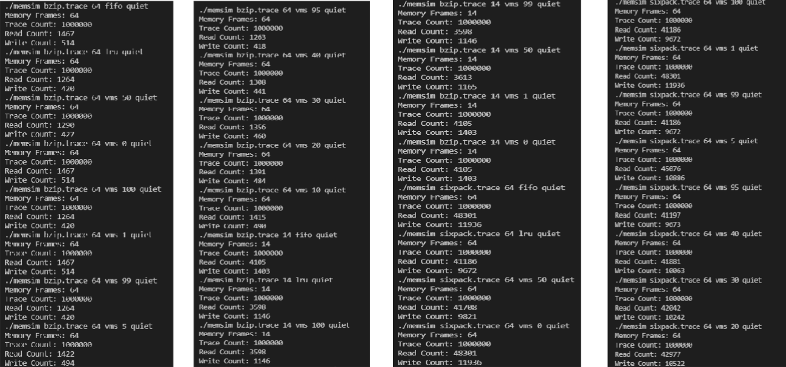

### This is a C++ Simulator that mimics FIFO, LRU, and SFIFO (Segemented FIFO) in C++. Trace files contain 1,000,000 traces.

## **Varibles**

A variable for each args

- .Trace File
- Number_of_frames
- Algorthim choice (FIFO, LRU, VMS)
- optional --> percentage
- quiet/debug

## **To Run**

Run _MAKE_ in the terminal to compile program.

Then, run in terminal by doing the following one of the following:

    ./memsim bzip.trace 32 fifo quiet
    OR
    ./memsim sixpack.trace 64 vms 50 debug

If you run FIFO or LRU, only **\<traceFile>\<sizeOfMemory>\<FIFO/LRU>\<debug/quiet>** is needed.

Else,

When you run Segmented FIFO, it's **\<traceFile>\<sizeOfMemory>\<VMS>\<sizeOfLRU>\<debug/quiet>**

Finally, outputs will look like:

